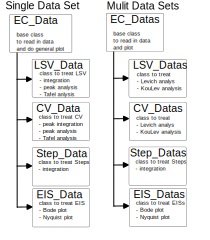

# EC4py documentation - Data Treament of Electrochemcial data made easy

**Source code:** [EC4py on Github](https://github.com/NordicEC/EC4py)

__________________________________
This [package](/EC4py/package/) offers classes representing data recorded different kinds of electrochemical techniques. Each class has a single and a multi data version. The latter version funktion as an array, and can be iterated.  
 
   

### [Arguments](package/ec4py_args.md) and [Keywords](package/ec4py_keywords.md)

The classes and class functions of ec4py use [arguments](package/ec4py_args.md) and [keywords](package/ec4py_keywords.md) to change the functionality of the data anlysis and plots. 

   intro
   install
   - [Install](/EC4py/install/)
   - [Package](/EC4py/package/)
   - [Examples](/EC4py/examples/)
    

