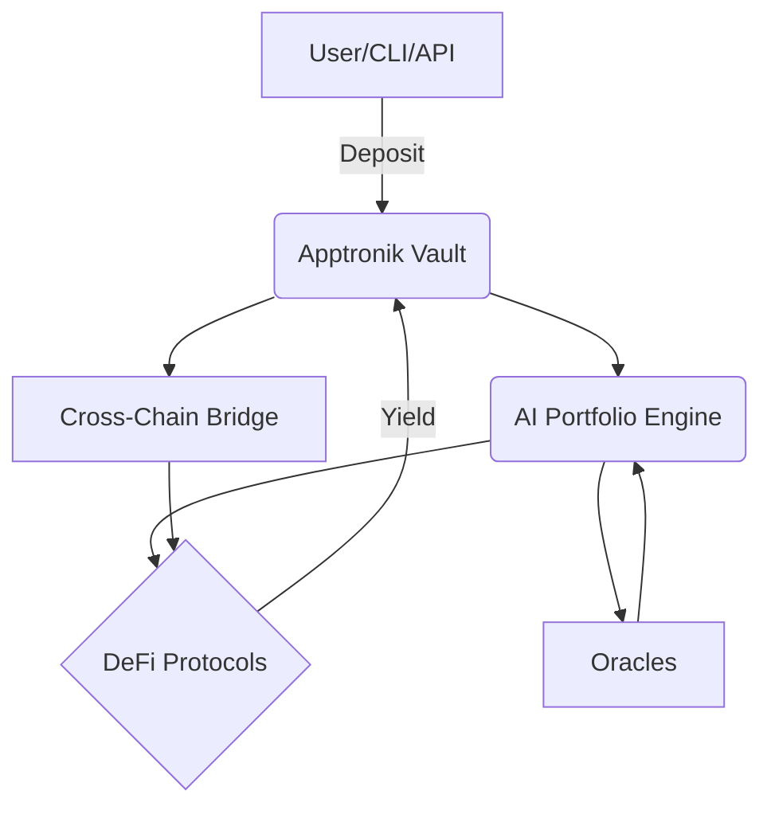

# Apptronik Autopilot — AI-Powered Crypto Asset Management

[](https://github.com/Apptronik-AI/autopilot/actions)
[](LICENSE)
[](https://www.python.org/)

[Website](https://www.apptronik-ai.com/) | [GitHub](https://github.com/Apptronik-AI) | [X/Twitter](https://x.com/Apptronik_AI)

---

## 🚀 Overview
Apptronik Autopilot is a production-ready, AI-powered autopilot protocol for Web3 and DeFi, built in Python. Effortlessly manage your crypto assets with AI-driven strategies, secure vaults, and seamless cross-chain connectivity.

---

## ✨ Features
- **Autonomous AI Yielding**: AI optimizes your portfolio and generates passive returns.
- **Secure Smart Vaults**: End-to-end encrypted, multi-sig, and time-locked withdrawals.
- **Zero-Gas Optimization**: Smart transactions with near-zero gas fees.
- **Cross-Chain Integration**: Deploy strategies across multiple blockchains.
- **Modular Architecture**: Easily extend with new strategies, protocols, or chains.
- **Production-Ready**: Logging, error handling, and test coverage included.

---

## 🏗️ Architecture


---

## 🛠️ Technology Stack
- **Language**: Python 3.8+
- **AI/ML**: TensorFlow, PyTorch (optional)
- **Web3**: web3.py, requests
- **Security**: python-dotenv, cryptography
- **Testing**: pytest
- **CI/CD**: GitHub Actions

---

## ⚡ Getting Started

### 1. Clone the Repository
```bash
git clone https://github.com/Apptronik-AI/autopilot.git
cd autopilot
```

### 2. Install Dependencies
```bash
pip install -r requirements.txt
```

### 3. Configure Environment
- Copy `.env.example` to `.env` and fill in your API keys, wallet addresses, and RPC endpoints.

### 4. Run the App
```bash
python main.py
```

---

## 🧩 Project Structure
```
apptronik-autopilot/
├── app/                # Main Python package
│   ├── core.py         # Core logic (strategies, vault, etc.)
│   ├── web3utils.py    # Web3 utilities
│   └── ...
├── tests/              # Unit and integration tests
├── .env.example        # Example environment variables
├── .gitignore          # Git ignore rules
├── main.py             # Entry point
├── requirements.txt    # Python dependencies
├── LICENSE             # License file
└── README.md           # This file
```

---

## 🚦 Advanced Usage
- **Strategy Plugins**: Add your own strategies in `app/strategies/`.
- **API Integration**: Expose endpoints with FastAPI or Flask (see `app/api.py`).
- **Monitoring**: Integrate with Prometheus/Grafana for metrics.

---

## 🧪 Testing
```bash
pytest tests/
```

---

## 🔒 Security Best Practices
- Never commit secrets or private keys. `.env` is gitignored.
- Use hardware wallets for production deployments.
- Review and test smart contract interactions on testnets first.
- Enable 2FA on all related accounts.

---

## 🤝 Contributing
We welcome contributions! Please:
- Fork this repo and create a feature branch
- Open a Pull Request with a clear description
- Do **not** commit sensitive data (private keys, credentials, etc.)

---

## 📄 License
MIT © Apptronik AI — See [LICENSE](LICENSE)

---

## 🌐 Resources
- [Official Website](https://www.apptronik-ai.com)
- [GitHub Organization](https://github.com/Apptronik-AI)
- [X/Twitter](https://x.com/Apptronik_AI)

---

© 2025 Apptronik AI. All rights reserved. 