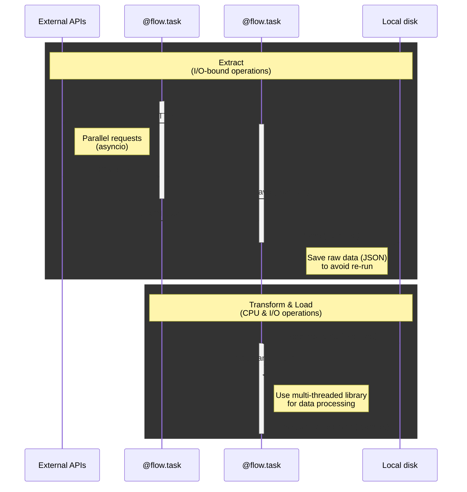

# Getting Started

**AsFlow** (short for "Async workflow") is a lightweight, asynchronous workflow runner built in pure Python. It's designed for ETL (Extract–Transform–Load) pipelines with a focus on minimal setup, fast iteration, and seamless integration with tools like [DuckDB](https://duckdb.org) and [Streamlit](https://streamlit.io).


## Basic Concept

With today’s **powerful local machines** and **highly optimized libraries**, many data processing workflows can run efficiently on your computer without requiring a cloud setup.

An ETL workflow typically involves two major stages:

#### 1. Extract (I/O-bound)

This stage involves fetching data from external sources like APIs or websites. Since network requests can be slow and unreliable, this step is ideal for asynchronous execution using Python’s `asyncio`. It allows multiple data sources to be queried concurrently, dramatically speeding up the extraction phase.

#### 2. Transform & Load (CPU-bound)

Once raw data is collected, it needs to be cleaned, filtered, transformed, and loaded into a usable format—such as structured tables or analytical files. This is CPU-intensive work, and libraries like [Polars](https://pola.rs) can leverage multi-core processing to accelerate it significantly.



### Why Separating These Stages Matters

The **Extract** phase is often the slowest and most fragile part of an ETL workflow. Things like network errors, API limits, or unexpected data formats can easily cause it to fail. To make your pipeline more reliable, it’s a good idea to save the raw data to your computer (for example, as JSON, CSV, or text files) right after downloading it. That way, if something goes wrong later, you won’t have to download everything again—you can just reuse the saved files.

**AsFlow** makes this process easy by letting you define modular, repeatable tasks. If a failure occurs, the pipeline can resume from the last successful step—no need to start over.

Once the data is safely extracted, you can iterate on the transformation and loading logic: extracting fields, computing summaries, reshaping formats, and preparing your data for analysis—all without having to re-fetch anything.

### Iterative Data Engineering with Streamlit

Using [Streamlit](https://streamlit.io) together with AsFlow makes it easy to build and test ETL pipelines in a highly interactive way.

Whenever you update your code—like changing a filter or modifying how data is processed—Streamlit automatically re-runs your script and updates the dashboard in your browser. You don’t need to restart anything manually.

This means you can see the results of your changes right away, making it easier to experiment, fix problems, and understand how each step affects your data.

## Your First Data Pipeline

Unlike many orchestration tools, AsFlow workflows are written using plain Python functions—no domain-specific languages (DSLs), configuration files, or complex frameworks required.

Let’s begin with a simple example and gradually improve it:

```python
# Task definitions

def get_urls():
    return [...]

def download(url):
    return ...

def transform(data):
    return ...

# Data pipeline

def pipeline():
    # 1. Get a list of URLs
    urls = get_urls()

    # 2. Download data from each url
    data = []
    for url in urls:
        data.append(download(url))

    # 3. Process all data
    return transform(data)

if __name__ == "__main__":
    pipeline()
```

This version is easy to understand—but it’s entirely sequential, so performance will degrade as the number of URLs increases.

### Improving Performance with Concurrency

To accelerate the pipeline, you can parallelize I/O-heavy tasks such as downloading. Python provides several options:

#### ✅ Using `ThreadPoolExecutor`

One traditional approach is to use `ThreadPoolExecutor` from the `concurrent.futures` module:

```python
from concurrent.futures import ThreadPoolExecutor

def pipeline():
    urls = get_urls()

    # Download data concurrently
    with ThreadPoolExecutor() as executor:
        data = list(executor.map(download, urls))

    return transform(data)
```

#### ⚡ Using `asyncio.TaskGroup` (Python 3.11+)

For I/O-bound workloads like HTTP requests, asynchronous programming with `asyncio` offers a modern, efficient solution:

```python
import asyncio

# Define async download task
async def download(url):
    return ...

async def pipeline():
    urls = get_urls()

    # Download concurrently using TaskGroup
    async with asyncio.TaskGroup() as tg:
        tasks = [tg.create_task(download(url)) for url in urls]

    return transform(await asyncio.gather(*tasks))
```

Both approaches speed up the extraction phase—but they still share a common problem:

**The pipeline re-downloads everything on each run, even if nothing has changed.**

### Avoiding Repeated Work with Memoization

Network I/O is slow and error-prone. To avoid redundant downloads and support recovery after failure, you can cache results locally.

A simple solution in Python is [Joblib](https://joblib.readthedocs.io):

```python
from joblib import Memory

# Set cache directory
memory = Memory(".cache")

@memory.cache
def download(url):
    return ...
```

With memoization, each result is saved the first time it’s computed. Future runs automatically reuse cached data—unless the function or its arguments change.

### How AsFlow Helps

AsFlow builds on these ideas and offers a streamlined experience tailored to ETL pipelines:

- ✅ Native support for both **synchronous and asynchronous tasks**
- 🔁 Automatic **retries** for transient failures
- 🧵 Configurable **concurrency limits** to avoid API throttling
- 📦 Persistent storage of **raw data** (e.g., JSON, CSV, text)
- 🗜️ Built-in **compression** support (.gz, .zst) to reduce file size
- 📊 **Rich console** integration for logging, progress bars, and status reports

## Flows and tasks

At the core of AsFlow is the concept of a **flow**—a lightweight wrapper that turns ordinary Python functions into modular, reusable components with file-based persistence.

AsFlow encourages you to structure your code using two types of functions:

- **Flows**: High-level data pipeline, decorated with `@flow`
- **Tasks**: Individual units of work, decorated with `@flow.task`

Here’s a minimal example:

```python
import asyncio
from asflow import flow

# Define a task function
@flow.task
async def download(url):
    return ...

# Define a flow function
@flow
async def pipeline():
    urls = get_urls()

    async with asyncio.TaskGroup() as tg:
        tasks = [tg.create_task(download(url)) for url in urls]

    return transform(await asyncio.gather(*tasks))
```

### No DAGs, Just Python

Traditional workflow tools often rely on DAGs (Directed Acyclic Graphs) to define execution order, managed by external schedulers.

**AsFlow does not use DAGs.**
A flow is simply an `async` function. You write your logic in plain Python and control the execution order directly—just like any other async program.

This design gives you the flexibility to use standard Python tools for managing concurrency and handling errors. You can run multiple tasks, or multiple flows, at the same time using `asyncio.TaskGroup` like this:

```python
async with asyncio.TaskGroup() as tg:
    # These tasks run concurrently
    tg.create_task(task1())
    tg.create_task(task2())
```

### Working with Synchronous Functions

AsFlow supports both asynchronous and synchronous functions for **tasks**, with some considerations depending on the use case:

#### ✅ Short-Running Sync Tasks

If a synchronous function executes quickly, you can call it directly within your flow:

```
@flow.task
def get_config():
    return {"key": "value"}

@flow
async def pipeline():
    config = get_config()
    ...
```

In this case, AsFlow simply execute the task in the running thread.

#### 🕒 Long-Running Sync Tasks

If a task is blocking (e.g., file I/O, CPU-bound logic), offload it to a background thread using `asyncio.to_thread()`:

```python
@flow.task
def get_urls():
    return [...]

@flow
async def pipeline():
    urls = await asyncio.to_thread(get_urls)
    ...
```

This keeps the event loop responsive and allows other async tasks to run concurrently.

### Running Multiple Flows Concurrently

When running multiple flows at the same time, it’s important to avoid blocking operations. A single long-running task can pause the entire process until it completes, which defeats the benefit of concurrency.

In the example below, `pipeline2()` contains a blocking task. Even though `pipeline1()` is written to run tasks in parallel, it will be held up because `pipeline2()` is not async-friendly:

```
# This flow runs tasks concurrently using asyncio
@flow
async def pipeline1():
    async with asyncio.TaskGroup() as tg:
        tg.create_task(task1())
        tg.create_task(task2())

# This flow contains a blocking call
@flow
async def pipeline2():
    long_running_task()  # blocks the event loop

# Run both flows at the same time
async def main():
    async with asyncio.TaskGroup() as tg:
        tg.create_task(pipeline1())
        tg.create_task(pipeline2())
```

AsFlow is designed to be lightweight and optimized for asynchronous tasks. It doesn’t handle process-level scheduling or distributed execution. For more complex systems or large-scale workflows, you may want to pair AsFlow with other tools that support multiprocessing or distributed orchestration.

## Persisting Task Results

In production ETL pipelines, it’s often essential to **persist intermediate results**. This improves reliability, reduces memory usage, and allows workflows to resume from checkpoints—saving time and avoiding redundant work after failures.

### Manual Persistence

Let’s enhance our pipeline by saving downloaded data to a `data/` directory:

```python
import polars as pl
from asflow import flow

@flow.task
async def download(url):
    filename = f"data/{hash(url)}.jsonl"
    with open(filename, "w") as f:
        f.write(...)  # write JSON records, one per line

@flow.task
def transform():
    # Combine all downloaded files into a single DataFrame
    return pl.read_ndjson("data/*.jsonl")

@flow
async def pipeline():
    urls = get_urls()

    async with asyncio.TaskGroup() as tg:
        for url in urls:
            tg.create_task(download(url))

    return transform()
```

Since each task writes directly to disk, we avoid storing large datasets in memory. This also simplifies the pipeline code, as there’s no longer a need to pass data through intermediate variables.

### Automatic Persistence

By default, `@flow.task` does not save task results between runs. If you want to avoid re-running expensive tasks, you need to explicitly enable persistence.

There are three common ways to do this, depending on your use case:

#### Option 1: Use the `on` Parameter

The built-in method to persist a task’s output is by using the `on` argument in `@flow.task`. This saves the result to a file after the first successful run and automatically skips the task in future runs if the file already exists.

```python
from asflow import flow

# Set the output file pattern
@flow.task(on="data/*.jsonl.zst")
async def download(url):
    flow.task.write("...")
```

The wildcard (`*`) in the path is replaced with a unique hash based on the task name and input (like the URL). You can use `.gz` or `.zst` file extensions to enable compression automatically.

This method is best for **raw data extraction**, where the result doesn’t change often and can be easily written to disk.

#### Option 2: Use Joblib for Caching

For more flexible caching—especially for in-memory transformations—you can use Joblib with `@memory.cache`.

```python
import polars as pl
from asflow import flow
from joblib import Memory

memory = Memory(".cache")

@flow.task
@memory.cache
def transform():
    return pl.read_ndjson("data/*.jsonl.zst")
```

Joblib stores results in a local cache directory. If the function’s code or parameters change, the cache is automatically invalidated and recomputed.

This is great for **transformation steps**, where you might frequently tweak the logic but the input data stays the same.

#### Option 3: Use Streamlit’s Cache

If you’re building a UI with Streamlit, you can use its built-in `@st.cache_data` decorator to cache the entire pipeline’s output:

```python
import streamlit as st

@st.cache_data
def read_data():
    return asyncio.run(pipeline())
```

This helps speed up development by avoiding re-runs while testing visualizations. However, Streamlit’s cache is memory-based during development—if you restart the app, the cache is cleared.

Use this for **final results used in dashboards**, not for long-running tasks you want to persist across restarts.

### Comparison of Persistence Methods

| Method | File path | Compression | Lifespan | Bast Use Case |
| --- | --- | --- | --- | --- |
| `@flow.task(on=...)` | User-defined | `.gz`, `.zst` | Until file is deleted | Raw data extractions |
| Joblib `@memory.cache` | Cache directory | None | Until code or parameters change | Data transformations |
| Streamlit `@st.cache_data` | In-memory | None | Until app reload or parameters change | Visualization / UI caching |

## Example: A Robust, Persistent ETL Pipeline

The example below shows a complete ETL workflow built with AsFlow. It demonstrates how to:

- **Fetch data asynchronously** using non-blocking I/O for better performance
- **Persist raw files to disk** so you don’t re-download the same data
- **Cache transformed results** to avoid recomputing unless the logic changes

It also integrates with Streamlit to create an interactive dashboard where you can explore your data in real time.

```python
import asyncio
import httpx
import polars as pl
import streamlit as st
from asflow import flow
from joblib import Memory

memory = Memory(".cache")

@flow.task
def get_urls():
    return [f"https://api.local/contents/{i}" for i in range(10)]

@flow.task(on="data/*.jsonl.zst")
async def download(url):
    # Use httpx for async data transfer
    async with httpx.AsyncClient() as client:
        r = await client.get(url)
        flow.task.write(r.text)

@flow.task
@memory.cache
def transform():
    df = pl.read_ndjson("data/*.jsonl.zst")
    # You can manipulate or clean the data here before visualization
    return df

@flow
async def pipeline():
    urls = get_urls()

    async with asyncio.TaskGroup() as tg:
        for url in urls:
            tg.create_task(download(url))

    return transform()

# Run the pipeline and cache the result for the dashboard
@st.cache_data
def read_data():
    df = asyncio.run(pipeline())
    # You can apply filters or aggregations here for display
    return df

# Show the final DataFrame in Streamlit
df = read_data()
st.write(df)
```

### How It Works

#### 🔄 Asynchronous Extraction with Persistence

The `download()` function uses `httpx` to fetch data from a remote API. Each result is saved to disk using AsFlow’s `on` parameter. On future runs, AsFlow automatically skips downloads if the output file already exists—saving time and bandwidth.

#### 🧪 Transformation with Joblib Caching

The `transform()` function reads the saved files into a Polars DataFrame. Joblib caches this result based on the function code and inputs. If nothing changes, AsFlow reuses the cached data instantly.

#### 📊 Interactive Visualization with Streamlit

Streamlit runs the entire pipeline and displays the final result. The `@st.cache_data` decorator ensures the dashboard doesn’t rerun the pipeline unless the parameters change. You get fast, repeatable analysis in the browser—ideal for debugging or prototyping.
