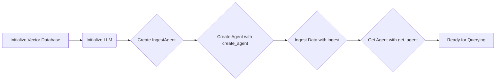

<div align="center">
<h1>ingest-anything</h1>
<h2>From data to vector database effortlessly</h2>
</div>
<br>
<div align="center">
    <a href="https://discord.gg/AXcVf269"></a>
</div>
<br>
<div align="center">
    
</div>

**`ingest-anything`** is a python package aimed at providing a smooth solution to ingest non-PDF files into vector databases, given that most ingestion pipelines are focused on PDF/markdown files. Leveraging [chonkie](https://docs.chonkie.ai/getting-started/introduction), [PdfItDown](https://github.com/AstraBert/PdfItDown), and [LlamaIndex](https://www.llamaindex.ai) integrations for vector databases and data loaders, `ingest-anything` gives you a fully-automated pipeline for document ingestion within few lines of code!

Find out more about `ingest-anything` on the [Documentation website](https://pdfitdown.eu/built-with-pdfitdown/ingest-anything)! (still under construction)

## Workflow

<div align="center">
    
</div>

**For text files**

- The input files are converted into PDF by PdfItDown
- The PDF text is extracted using LlamaIndex-compatible reader
- The text is chunked exploiting Chonkie's functionalities
- The chunks are embedded thanks to an Embedding model from Sentence Transformers, OpenAI, Cohere, Jina AI or Model2Vec
- The embeddings are loaded into a LlamaIndex-compatible vector database

**For code files**

- The text is extracted from code files using LlamaIndex SimpleDirectoryReader
- The text is chunked exploiting Chonkie's CodeChunker
- The chunks are embedded thanks to an Embedding model from Sentence Transformers, OpenAI, Cohere, Jina AI or Model2Vec
- The embeddings are loaded into a LlamaIndex-compatible vector database

\*_For web data_

- HTML content is scraped from URLs with [crawlee](https://crawlee.dev)
- HTML files are turned into PDFs with PdfItDown
- The text is extracted from PDF files using LlamaIndex PyMuPdfReader
- The text is chunked exploiting Chonkie's chunkers
- The chunks are embedded thanks to an Embedding model from Sentence Transformers, OpenAI, Cohere, Jina AI or Model2Vec
- The embeddings are loaded into a LlamaIndex-compatible vector database

**For Agent Workflow**

- Initialize a vector database (e.g., Qdrant, Weaviate).
- Initialize a language model (LLM) (e.g., OpenAI).
- Create an `IngestAgent` instance.
- Use the `create_agent` method to generate a specific agent type (e.g., `IngestAnythingFunctionAgent`, `IngestCodeReActAgent`).
- Ingest data using the agent's `ingest` method.
- Retrieve the agent using the `get_agent` method for querying and interaction.

## Usage

`ingest-anything` can be installed using `pip` in the following way:

```bash
pip install ingest-anything
# or, for a faster installation
uv pip install ingest-anything
```

And is available in your python scripts:

- You can **initialize the interface for text-based files** like this:

```python
from qdrant_client import QdrantClient, AsyncQdrantClient
from llama_index.vector_stores.qdrant import QdrantVectorStore

client_qdrant = QdrantClient("http://localhost:6333")
aclient_qdrant = AsyncQdrantClient("http://localhost:6333")
vector_store_qdrant = QdrantVectorStore(
    collection_name="Test", client=client_qdrant, aclient=aclient_qdrant
)
ingestor = IngestAnything(vector_store=vector_store_qdrant)
```

- And **ingest** your files:

```python
# with a list of files
ingestor.ingest(
    chunker="late",
    files_or_dir=[
        "tests/data/test.docx",
        "tests/data/test0.png",
        "tests/data/test1.csv",
        "tests/data/test2.json",
        "tests/data/test3.md",
        "tests/data/test4.xml",
        "tests/data/test5.zip",
    ],
    embedding_model="sentence-transformers/all-MiniLM-L6-v2",
)
# with a directory
ingestor.ingest(
    chunker="token",
    files_or_dir="tests/data",
    tokenizer="gpt2",
    embedding_model="sentence-transformers/all-MiniLM-L6-v2",
)
```

- You can also **initialize the interface for code files**

```python
import os
from dotenv import load_dotenv
import weaviate
from llama_index.vector_stores.weaviate import WeaviateVectorStore
from ingest_anything.ingestion import IngestCode

load_dotenv()

cluster_url = os.getenv("weaviate_cluster_url")
api_key = os.getenv("weaviate_admin_key")
client_weaviate = weaviate.connect_to_weaviate_cloud(
    cluster_url=cluster_url,
    auth_credentials=weaviate.auth.AuthApiKey(api_key),
)
vector_store_weaviate = WeaviateVectorStore(
    weaviate_client=client_weaviate, index_name="Test"
)

ingestor = IngestCode(vector_store=vector_store_qdrant)
```

- And then **ingest your code files**:

```python
os.environ["OPENAI_API_KEY"] = "YOUR_API_KEY"
ingestor.ingest(
    files=[
        "tests/code/acronym.go",
        "tests/code/animal_magic.go",
        "tests/code/atbash_cipher_test.go",
    ],
    embedding_model="text-embedding-3-small",
    language="go",
)
```

You can also ingest **data from the web**:

```python
import os
from dotenv import load_dotenv
import weaviate
from llama_index.vector_stores.weaviate import WeaviateVectorStore
from ingest_anything.web_ingestion import IngestWeb

load_dotenv()

cluster_url = os.getenv("weaviate_cluster_url")
api_key = os.getenv("weaviate_admin_key")
client_weaviate = weaviate.connect_to_weaviate_cloud(
    cluster_url=cluster_url,
    auth_credentials=weaviate.auth.AuthApiKey(api_key),
)
vector_store_weaviate = WeaviateVectorStore(
    weaviate_client=client_weaviate, index_name="Test"
)

ingestor = IngestWeb(vector_store=vector_store_qdrant)
```

And now ingest starting from one or more URLs:

```python
import asyncio
async def main():
	await ingestor.ingest(
    	urls = [
        	"https://astrabert.github.io/hophop-science/AI-is-turning-nuclear-a-review/",
        	"https://astrabert.github.io/hophop-science/BrAIn-next-generation-neurons/",
        	"https://astrabert.github.io/hophop-science/Attention-and-open-source-is-all-you-need/",
    	],
    	chunker="slumber",
    	slumber_genie="openai",
    	slumber_model="gpt-4o-mini",
    	embedding_model="sentence-transformers/all-MiniLM-L6-v2",
	)

if __name__ == "__main__":
	asyncio.run(main())
```

You can also create a **RAG agent in a fully automated way**:

```python
from qdrant_client import QdrantClient
from llama_index.llms.openai import OpenAI
from llama_index.vector_stores.qdrant import QdrantVectorStore
from ingest_anything.agent import IngestAgent

# 1. Initialize Vector Database and LLM
client = QdrantClient(":memory:")  # Or your Qdrant setup
llm = OpenAI(api_key="YOUR_API_KEY")

# 2. Initialize IngestAgent
agent_factory = IngestAgent()
vector_store = QdrantVectorStore(
    client=client, collection_name="my_collection"
)

# 3. Create Agent
agent = agent_factory.create_agent(
    vector_database=vector_store,
    llm=llm,
    ingestion_type="anything",  # or "code"
    agent_type="function_calling",  # or "react"
)

# 4. Ingest Data
agent.ingest(
    files_or_dir="path/to/documents",
    embedding_model="sentence-transformers/all-mpnet-base-v2",
    chunker="semantic",
    similarity_threshold=0.8,
)

# 5. Get Agent for Querying
function_agent = (
    agent.get_agent()
)  # or react_agent = agent.get_agent() if you chose react
```

Find a representation of the agent workflow in the following diagram:



You can find a complete reference for the package in [REFERENCE.md](https://github.com/AstraBert/ingest-anything/tree/main/REFERENCE.md)

### Contributing

Contributions are always welcome!

Find contribution guidelines at [CONTRIBUTING.md](https://github.com/AstraBert/ingest-anything/tree/main/CONTRIBUTING.md)

### License and Funding

This project is open-source and is provided under an [MIT License](https://github.com/AstraBert/ingest-anything/tree/main/LICENSE).

If you found it useful, please consider [funding it](https://github.com/sponsors/AstraBert).
