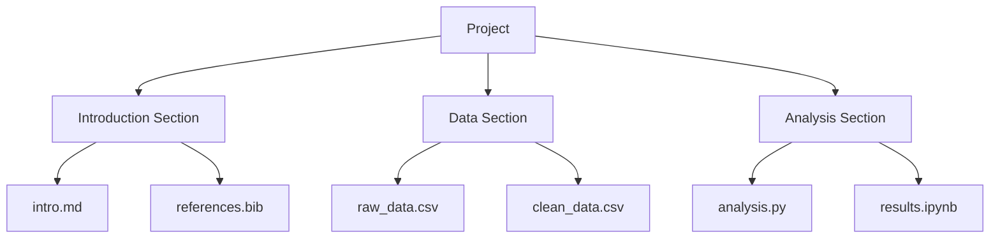

# Quick Start

Get up and running with LDA in 5 minutes. This guide will walk you through creating your first project and understanding the core concepts.

## 1. Initialize a New Project

Navigate to your project directory and initialize LDA:

```bash
cd my-project
lda init
```

LDA will guide you through the setup:

```
Project name: My Research Project
Project code: RESEARCH
Author: Jane Smith
```

This creates:
- `lda_config.yaml` - Your project configuration
- `.lda/` - LDA tracking directory
- Project structure based on your template

## 2. Explore Your Configuration

Open `lda_config.yaml` to see your project setup:

```yaml
project:
  name: "My Research Project"
  code: "RESEARCH"
  author: "Jane Smith"
  
sections:
  introduction:
    name: "Introduction"
    files:
      - "docs/intro.md"
      - "docs/intro_references.bib"
  
  data:
    name: "Data Analysis"
    files:
      - "data/*.csv"
      - "scripts/analysis.py"
```

## 3. Add Files to Your Project

Create some example files:

```bash
# Create directories
mkdir -p docs data scripts

# Create sample files
echo "# Introduction" > docs/intro.md
echo "id,value\n1,100\n2,200" > data/sample.csv
echo "import pandas as pd" > scripts/analysis.py
```

## 4. Track Your Files

Tell LDA to start monitoring your files:

```bash
lda track
```

Output:
```
📁 Tracking project files...
✓ docs/intro.md
✓ data/sample.csv
✓ scripts/analysis.py
📊 3 files tracked
```

## 5. Check Project Status

View your project's current state:

```bash
lda status
```

Output:
```
Project: My Research Project (RESEARCH)
Author: Jane Smith
Sections: 2
Files tracked: 3
Last modified: 2 minutes ago
```

## 6. Detect Changes

Modify a file and check for changes:

```bash
echo "Additional content" >> docs/intro.md
lda changes
```

Output:
```
🔍 Detecting changes...
📝 Modified: docs/intro.md
  Size: 15 → 33 bytes
  Modified: 2 seconds ago
```

## Interactive Demo

Try this complete workflow:

```bash
# 1. Create a test directory
mkdir lda-demo && cd lda-demo

# 2. Initialize with a template
lda init --template research

# 3. Create some files
echo "# Research Protocol" > docs/protocol.md
echo "Sample data" > data/experiment_001.csv

# 4. Track and monitor
lda track
lda status --verbose

# 5. Make changes
echo "## Methods" >> docs/protocol.md
lda changes

# 6. Export a report
lda export --format html
```

## Key Commands Reference

| Command | Description | Example |
|---------|-------------|---------|
| `init` | Initialize new project | `lda init --template research` |
| `track` | Track project files | `lda track --all` |
| `status` | Show project status | `lda status --verbose` |
| `changes` | Detect file changes | `lda changes --since 1h` |
| `export` | Export reports | `lda export --format pdf` |

## Understanding Sections

LDA organizes your project into **sections** - logical groupings of related files:



Each section can have:
- Multiple files
- Different file types
- Custom tracking rules
- Specific workflows

## Next Steps

Now that you understand the basics:

<div class="grid cards" markdown>

-   :material-file-document-outline:{ .lg .middle } __First Project__

    ---

    Build a complete project from scratch
    
    [:octicons-arrow-right-24: Create project](first-project.md)

-   :material-book-open-variant:{ .lg .middle } __User Guide__

    ---

    Deep dive into LDA concepts
    
    [:octicons-arrow-right-24: Learn more](../user-guide/concepts.md)

-   :material-palette:{ .lg .middle } __Templates__

    ---

    Explore available project templates
    
    [:octicons-arrow-right-24: View templates](../user-guide/templates.md)

</div>

## Quick Tips

!!! tip "Pro Tips"

    - Use `lda track --watch` to monitor changes in real-time
    - Add `--json` to any command for machine-readable output
    - Set up `.ldarc` for project-specific configurations
    - Use `lda help <command>` for detailed command help

!!! example "Common Workflows"

    **Research Project**
    ```bash
    lda init --template research
    lda track
    lda status --sections
    ```
    
    **Software Documentation**
    ```bash
    lda init --template docs
    lda track --exclude "*.log"
    lda export --format html
    ```
    
    **Data Analysis**
    ```bash
    lda init --template data-science
    lda track --watch
    lda changes --since yesterday
    ```