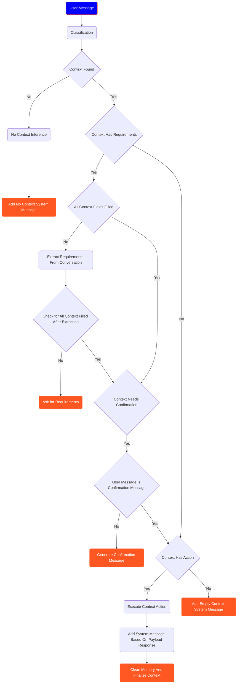

```mermaid
    flowchart TD

        %% Nodes
        UserMessage("User Message")
        Clasification("Classification")
        ContextFound{"Context Found"}
        NoContextInferece("No Context Inference")
        ContextHasRequirements{"Context Has Requirements"}
        AddNoContextSystemMessage("Add No Context System Message")
        AddEmptyContextSystemMessate("Add Empty Context System Message")
        AllContextFieldsFilled{"All Context Fields Filled"}
        ContextHasAction{"Context Has Action"}
        ExtractRequirementsFromConversation("Extract Requirements From Conversation")
        CheckForAllContextFilledAfterExtraction{"Check for All Context Filled After Extraction"}
        GenerateConfirmationMessage("Generate Confirmation Message")
        ContextNeedsConfirmation{"Context Needs Confirmation"}
        AskForRequirements("Ask for Requirements")
        UserMessageIsConfirmationMessage{"User Message is Confirmation Message"}
        ExecuteContextAction("Execute Context Action")
        AddSystemMessageBasedOnResponsePayload("Add System Message Based On Payload Response")
        CleanMemoryAndFinalizeContext("Clean Memory And Finalize Context")

        %% Edge connections between nodes
        UserMessage --> Clasification --> ContextFound
        ContextFound -->|No | NoContextInferece
        NoContextInferece --> AddNoContextSystemMessage
        ContextFound -->|Yes | ContextHasRequirements
        ContextHasRequirements -->|Yes | AllContextFieldsFilled
        AllContextFieldsFilled --> |No | ExtractRequirementsFromConversation --> CheckForAllContextFilledAfterExtraction --> |No | AskForRequirements
        AllContextFieldsFilled -->|Yes | ContextNeedsConfirmation
        CheckForAllContextFilledAfterExtraction -->|Yes | ContextNeedsConfirmation
        ContextNeedsConfirmation --> |Yes | UserMessageIsConfirmationMessage --> |No | GenerateConfirmationMessage
        UserMessageIsConfirmationMessage --> |Yes | ContextHasAction --> |Yes | ExecuteContextAction --> AddSystemMessageBasedOnResponsePayload --> CleanMemoryAndFinalizeContext
        ContextHasAction --> |No | AddEmptyContextSystemMessate
        
        ContextHasRequirements -->|No | ContextHasAction

        %% Node Styling
        style UserMessage fill:#0000FF, stroke:#FF5722, color:#FFFFFF
        style AddNoContextSystemMessage fill:#FF5722, stroke:#FF5722, color:#FFFFFF
        style AskForRequirements fill:#FF5722, stroke:#FF5722, color:#FFFFFF
        style GenerateConfirmationMessage fill:#FF5722, stroke:#FF5722, color:#FFFFFF
        style CleanMemoryAndFinalizeContext fill:#FF5722, stroke:#FF5722, color:#FFFFFF
        style AddEmptyContextSystemMessate fill:#FF5722, stroke:#FF5722, color:#FFFFFF
```