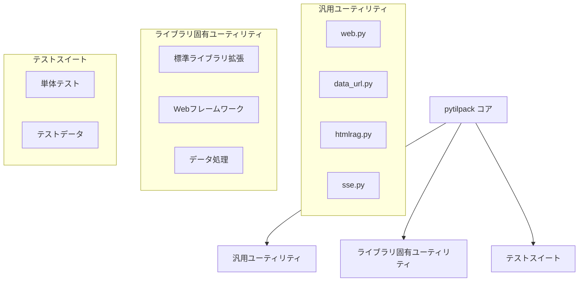
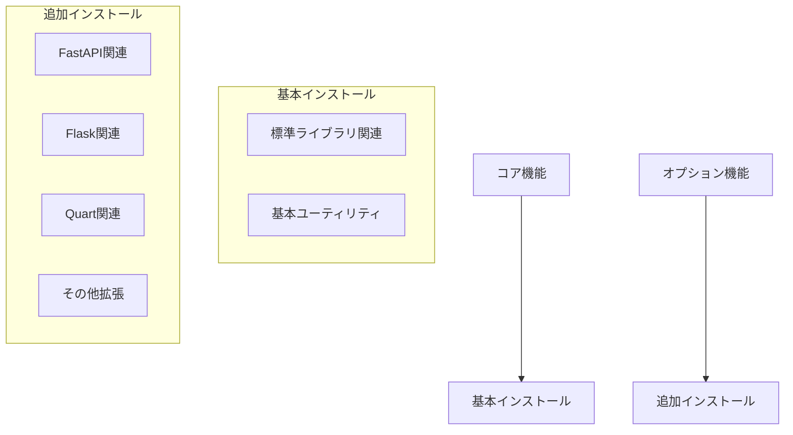

# システムパターン

## 全体アーキテクチャ



## 設計原則

### 1. Webフレームワーク関連モジュール構造

```mermaid
graph TD
    subgraph Flask
        Flask[flask_]
        FlaskAsserts[asserts.py]
        FlaskProxy[proxy_fix.py]
        FlaskMisc[misc.py]
        FlaskInit[__init__.py]
        Flask --> FlaskAsserts
        Flask --> FlaskProxy
        Flask --> FlaskMisc
        Flask --> FlaskInit
    end

    subgraph FastAPI
        FastAPI[fastapi_]
        FastAPIAsserts[asserts.py]
        FastAPIInit[__init__.py]
        FastAPI --> FastAPIAsserts
        FastAPI --> FastAPIInit
    end

    subgraph Quart
        Quart[quart_]
        QuartAsserts[asserts.py]
        QuartProxy[proxy_fix.py]
        QuartInit[__init__.py]
        Quart --> QuartAsserts
        Quart --> QuartProxy
        Quart --> QuartInit
    end
```

#### 共通パターン

- asserts.py: テストコード用アサーション関数を集約
- proxy_fix.py: リバースプロキシ対応のミドルウェア
- misc.py: その他のユーティリティ機能
- __init__.py: すべての機能を再エクスポート（後方互換性維持）

### 2. 一般的なモジュール構造

- ライブラリ固有のユーティリティは`xxx_`形式で命名
- 汎用ユーティリティは単純な`xxx`形式で命名
- 各モジュールは単一の責任を持つ
- 依存関係は明示的に管理

### 2. インターフェース設計

- シンプルで直感的なAPI
- 一貫した命名規則
- 適切な型ヒントの使用
- 明確なdocstring

### 3. 依存関係管理



## 実装パターン

### 1. エラー処理

```python
def safe_operation() -> str | None:
    """安全な操作の実行。"""
    try:
        return perform_operation()
    except SpecificError:
        logging.error("具体的なエラー内容")
        return None
```

### 2. 非同期処理

```python
async def async_operation() -> None:
    """非同期操作の実行。"""
    async with resource_context():
        await process_data()
```

### 3. 非同期イテレーター処理

```python
async def process_async_iterator(
    it: AsyncIterator[T], interval: float
) -> AsyncIterator[T]:
    """非同期イテレーターの処理。

    - イベントループを直接使用してタイムアウト制御
    - キャンセル処理の適切なハンドリング
    - StopAsyncIterationの適切な処理
    """
    loop = asyncio.get_running_loop()
    next_task = loop.create_task(anext(it))

    try:
        while True:
            done, _ = await asyncio.wait(
                [next_task], timeout=interval,
                return_when=asyncio.FIRST_COMPLETED
            )
            if next_task in done:
                try:
                    msg = next_task.result()
                except StopAsyncIteration:
                    break
                yield msg
                next_task = loop.create_task(anext(it))
            else:
                # タイムアウト時の処理
                pass
    except asyncio.CancelledError:
        # キャンセル時の適切な終了処理
        return
```

### 4. データクラスパターン

```python
@dataclasses.dataclass
class MessageFormat:
    """メッセージフォーマット。

    - 必須フィールドは型のみ指定
    - オプションフィールドはNone付きで定義
    - シリアライズメソッドを提供
    """
    data: str
    metadata: str | None = None

    def serialize(self) -> str:
        """データのシリアライズ。"""
        lines = []
        if self.metadata is not None:
            lines.append(f"meta: {self.metadata}")
        lines.append(f"data: {self.data}")
        return "\n".join(lines)
```

### 5. テストパターン

```python
@pytest.mark.parametrize(
    "input,expected",
    [
        (case1, result1),
        (case2, result2),
    ],
)
def test_function(input: str, expected: str) -> None:
    """関数のテスト。"""
    assert function(input) == expected

@pytest.mark.asyncio
async def test_async_operation():
    """非同期処理のテスト。

    - タイミングに依存する処理のテスト
    - キャンセル処理のテスト
    - 非同期イテレーターのテスト
    """
    result = await async_operation()
    assert result == expected
```

## 重要な実装パス

### 1. モジュール初期化

- `__init__.py`でのバージョン定義
- 型ヒントの有効化（`py.typed`）
- 必要な依存関係の確認

### 2. 機能拡張

- 新機能の追加時は対応するテストも作成
- バージョン互換性の維持
- ドキュメントの更新

### 3. リリースプロセス

1. テストの実行と確認
2. バージョン番号の更新
3. GitHub Actionsでの検証
4. PyPIへのパッケージ公開
