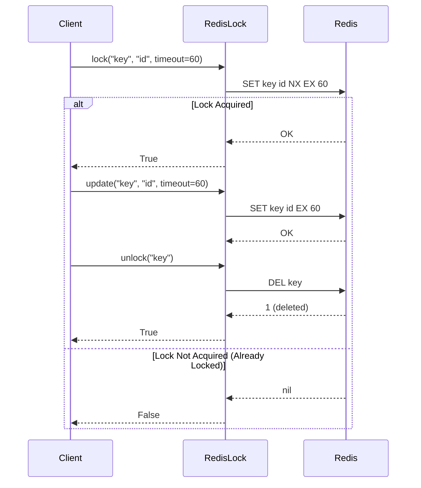
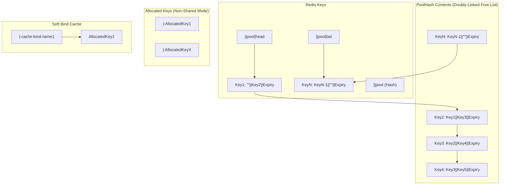
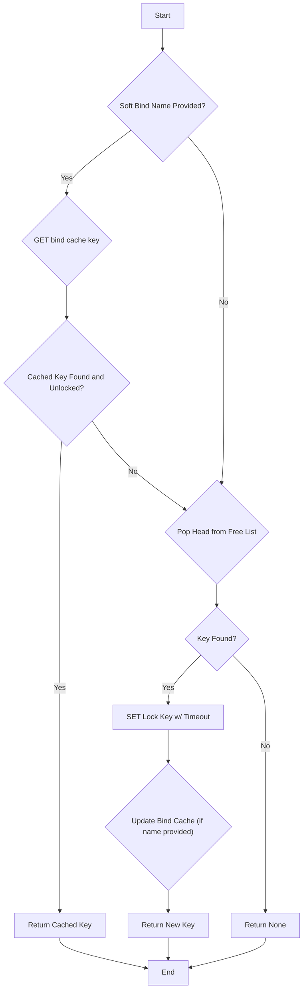
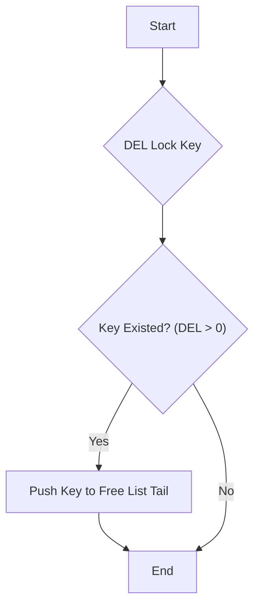
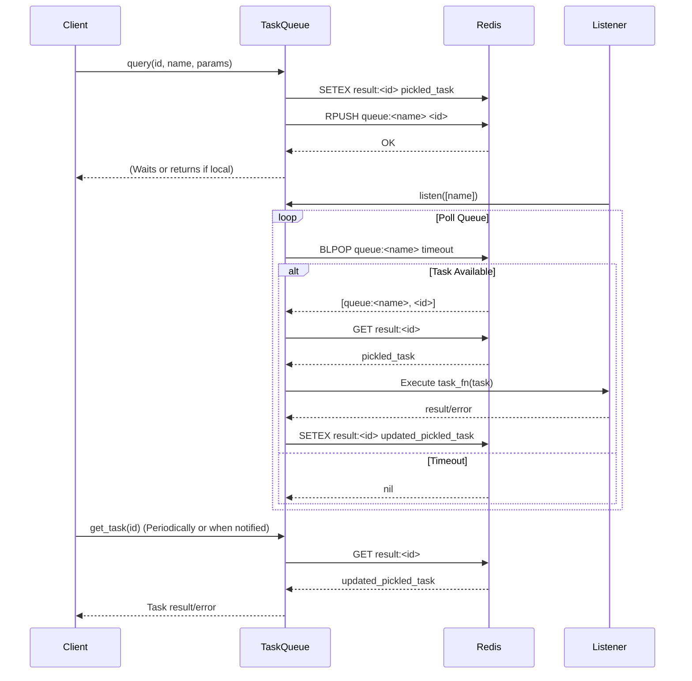

# RedisAllocator

## Project Overview

RedisAllocator provides robust and efficient components for managing distributed resources using Redis. It's designed specifically for scenarios requiring high availability, automatic recovery, and flexible allocation strategies, such as managing pools of proxies, workers, or other limited resources.

The core philosophy is to leverage Redis's speed and atomic Lua scripting capabilities to ensure consistency and performance for resource allocation, locking, and task queuing, while operating within a single Redis instance for simplicity and atomicity guarantees.

> **Note**: RedisAllocator is optimized for single Redis instance deployments. Its reliance on Lua scripting for atomicity makes it unsuitable for standard Redis Cluster configurations. For cluster environments, consider alternative locking mechanisms like RedLock.

## Core Design Principles & Features

RedisAllocator is built around these key ideas:

-   **Efficient Resource Pooling:** Manages a pool of available resources, enabling clients to check out (allocate) and return (free) resources.
-   **Atomic Operations:** Utilizes Redis Lua scripts extensively to guarantee atomicity for critical pool management operations, preventing race conditions in distributed environments.
-   **Automatic Recovery (Garbage Collection):** Implements configurable garbage collection to automatically detect and recycle resources that are no longer in use (e.g., due to client crashes or expired locks), crucial for maintaining pool health.
-   **Flexible Allocation Modes:** Supports both **exclusive** (`shared=False`, default) allocation where a resource is locked for one client, and **shared** (`shared=True`) allocation where multiple clients can use the same resource concurrently.
-   **Resource Prioritization (Planned):** A key upcoming feature allowing resources to be allocated based on defined priorities (e.g., allocating faster proxies first), using Redis Sorted Sets.
-   **Resource Affinity (Soft Binding):** Allows associating specific names (e.g., a worker ID or a specific task type) with resources, enabling consistent reuse of the same resource for that name, useful for caching or specialized tasks.
-   **Distributed Locking:** Provides a standalone, robust distributed lock (`RedisLock`) with automatic expiry and reentrancy support.
-   **Task Queuing:** Includes a basic distributed task queue (`RedisTaskQueue`) for coordinating work among multiple consumers.

### Core Features

- **Distributed Locking**: Provides robust distributed locking mechanisms to ensure data consistency in concurrent environments
- **Resource Allocation**: Implements a distributed resource allocation system with support for:
  - Priority-based distribution
  - Soft binding
  - Garbage collection
  - Health checking
- **Task Management**: Implements a distributed task queue system for efficient task processing across multiple workers
- **Object Allocation**: Supports allocation of resources with priority-based distribution and soft binding
- **Health Checking**: Monitors the health of distributed instances and automatically handles unhealthy resources
- **Garbage Collection**: Automatically identifies and reclaims unused resources, optimizing memory usage
- **Shared Mode**: Configurable allocation modes supporting both exclusive and shared resource usage
- **Soft Binding**: Associates named objects with specific resources for consistent allocation

## Documentation

For complete documentation, please visit our [official documentation site](https://invoker-bot.github.io/RedisAllocator-python/).

## Installation

```bash
pip install redis-allocator
```

## Quick Start

### Using RedisLock for Distributed Locking

RedisLock provides distributed locking with the following important characteristics:

- **Automatic Expiry**: Locks are automatically released after a timeout period, preventing deadlocks when clients fail
- **Active Update Required**: Lock holders must actively update their locks to maintain ownership
- **Thread Identification**: Each lock can include a thread identifier to determine ownership
- **Reentrant Locking**: Same thread/process can reacquire its own locks using the rlock method

```python
from redis import Redis
from redis_allocator import RedisLock
import threading
import time

# Initialize Redis client (requires a single Redis instance)
redis = Redis(host='localhost', port=6379, decode_responses=True)

# Create a RedisLock instance
lock = RedisLock(redis, "myapp", "resource-lock")

# Use the current thread ID as the lock identifier
thread_id = str(threading.get_ident())

# Acquire a lock with a 60-second timeout
if lock.lock("resource-123", value=thread_id, timeout=60):
    try:
        # Perform operations with the locked resource
        print("Resource locked successfully")
        
        # For long-running operations, periodically update the lock
        # to prevent timeout expiration
        for _ in range(5):
            time.sleep(10)  # Do some work
            
            # Extend the lock's lifetime by updating it
            lock.update("resource-123", value=thread_id, timeout=60)
            print("Lock updated, timeout extended")
            
        # Example of reentrant locking with rlock (succeeds because same thread_id)
        if lock.rlock("resource-123", value=thread_id):
            print("Successfully re-locked the resource")
    finally:
        # Release the lock when done
        lock.unlock("resource-123")
        print("Resource unlocked")
else:
    print("Could not acquire lock - resource is busy")
```

**Key Concepts:**
- If a lock holder fails to update within the timeout period, the lock is automatically released
- Using `rlock()` allows the same thread to reacquire a lock it already holds
- This implementation only works with a single Redis instance (not Redis Cluster)
- In a distributed system, each node should use a unique identifier as the lock value

**Simplified Lock Flow:**



### Using RedisAllocator for Resource Management

```python
from redis import Redis
from redis_allocator import RedisAllocator

# Initialize Redis client
redis = Redis(host='localhost', port=6379)

# Create a RedisAllocator instance
allocator = RedisAllocator(
    redis, 
    prefix='myapp',
    suffix='allocator',
    shared=False  # Whether resources can be shared
)

# Add resources to the pool
allocator.extend(['resource-1', 'resource-2', 'resource-3'])

# Allocate a resource key (returns only the key)
key = allocator.malloc_key(timeout=120)
if key:
    try:
        # Use the allocated resource
        print(f"Allocated resource: {key}")
    finally:
        # Free the resource when done
        allocator.free_keys(key)

# Allocate a resource with object (returns a RedisAllocatorObject)
allocated_obj = allocator.malloc(timeout=120)
if allocated_obj:
    try:
        # The key is available as a property
        print(f"Allocated resource: {allocated_obj.key}")
        
        # Update the resource's lock timeout
        allocated_obj.update(timeout=60)
    finally:
        # Free the resource when done
        allocator.free(allocated_obj)

# Using soft binding (associates a name with a resource)
allocator.update_soft_bind("worker-1", "resource-1")
# Unbind soft binding
allocator.unbind_soft_bind("worker-1")

# Garbage collection (reclaims unused resources)
allocator.gc(count=10)  # Check 10 items for cleanup
```

### Shared Mode vs Non-Shared Mode

RedisAllocator supports two allocation modes:

#### Non-shared Mode (default, `shared=False`)
- Resources are allocated exclusively to one client/thread
- When allocated, the resource is locked, preventing others from using it
- The resource remains locked until explicitly freed or until its timeout expires
- Ideal for scenarios where resources must be used exclusively

```python
# Non-shared allocator (exclusive resource usage)
exclusive_allocator = RedisAllocator(redis, "myapp", shared=False)

# When a resource is allocated, it's locked and cannot be allocated by others
key = exclusive_allocator.malloc_key(timeout=120)
if key:
    # Only this client can use the key until it's freed or timeout expires
    exclusive_allocator.free_keys(key)
```

#### Shared Mode (`shared=True`)
- Resources can be used concurrently by multiple clients/threads
- When allocated, the resource is made available from the free list but not locked
- Multiple clients can allocate and use the same resource simultaneously
- Ideal for read-only resources or resources that support concurrent access

```python
# Shared allocator (concurrent resource usage)
shared_allocator = RedisAllocator(redis, "myapp", shared=True)

# Resources can be accessed by multiple clients simultaneously
key = shared_allocator.malloc_key(timeout=120)
if key:
    # Other clients can also allocate and use this same key
    shared_allocator.free_keys(key)
```

### Soft Binding Mechanism

Soft binding creates persistent associations between named objects and allocated resources:

**Allocator Pool Structure (Conceptual):**



**Simplified Allocation Flow (Non-Shared Mode):**



**Simplified Free Flow (Non-Shared Mode):**



```python
from redis import Redis
from redis_allocator import RedisAllocator, RedisAllocatableClass

# Create a custom allocatable class with a name
class MyResource(RedisAllocatableClass):
    def __init__(self, resource_name):
        self._name = resource_name
    
    def set_config(self, key, params):
        # Configure the resource when allocated
        self.key = key
        self.config = params
    
    @property
    def name(self):
        # Name used for soft binding
        return self._name

# Initialize allocator
redis = Redis(host='localhost', port=6379)
allocator = RedisAllocator(redis, "myapp")

# Add resources to the pool
allocator.extend(['resource-1', 'resource-2', 'resource-3'])

# Create a named resource object
resource = MyResource("database-connection")

# First allocation will assign a key from the pool
allocation1 = allocator.malloc(timeout=60, obj=resource)
print(f"First allocation: {allocation1.key}")  # e.g., "resource-1"

# Free the resource
allocator.free(allocation1)

# Later allocation of the same named object will try to reuse the same key
# Can specify a custom cache timeout for the binding
allocation2 = allocator.malloc(timeout=60, obj=resource, cache_timeout=300)
print(f"Second allocation: {allocation2.key}")  # Will be "resource-1" again

# Benefits of soft binding:
# 1. Resource affinity - same object gets same resource consistently
# 2. Optimized caching and resource reuse
# 3. Predictable resource mapping for debugging
```

Key features of soft binding:
- Bindings persist even after the resource is freed, with a configurable timeout
- If a bound resource is no longer available, a new resource is automatically allocated
- Explicit unbinding is available with `unbind_soft_bind(name)`
- Soft bindings have their own timeout (default 3600 seconds) separate from resource locks

### Using RedisTaskQueue for Distributed Task Processing

**Simplified Task Queue Flow:**



```python
from redis import Redis
from redis_allocator import RedisTaskQueue, TaskExecutePolicy
import json

# Initialize Redis client
redis = Redis(host='localhost', port=6379)

# Process tasks in a worker
def process_task(task):
    # Process the task (task is a RedisTask object)
    # You can access task.id, task.name, task.params
    # You can update progress with task.update(current, total)
    return json.dumps({"result": "processed"})


# Create a task queue
task_queue = RedisTaskQueue(redis, "myapp", task_fn=process_task)

# Submit a task with query method
result = task_queue.query(
    id="task-123",
    name="example-task",
    params={"input": "data"},
    timeout=300,  # Optional timeout in seconds
    policy=TaskExecutePolicy.Auto,  # Execution policy
    once=False  # Whether to delete the result after getting it
)

# Start listening for tasks
task_queue.listen(
    names=["example-task"],  # List of task names to listen for
    workers=128,  # Number of worker threads
    event=None  # Optional event to signal when to stop listening
)
```

## Modules

RedisAllocator consists of several modules, each providing specific functionality:

- **lock.py**: Provides `RedisLock` and `RedisLockPool` for distributed locking mechanisms
- **task_queue.py**: Implements `RedisTaskQueue` for distributed task processing
- **allocator.py**: Contains `RedisAllocator` and related classes for resource allocation

*(Note: Internal comments and Lua script explanations within these modules have been recently refactored for better clarity.)*

### RedisAllocator Architecture

The RedisAllocator maintains resources in a doubly-linked list structure stored in Redis:
- Available resources are kept in a "free list"
- In non-shared mode, allocated resources are removed from the free list and locked
- In shared mode, allocated resources are still available for allocation by others
- The Garbage Collector periodically:
  - Reclaims locked resources whose locks have expired
  - Removes expired resources based on their configured timeouts
  - Cleans up inconsistent states between allocations and locks
- Soft bindings are implemented as separate locks with their own timeout period

## Roadmap

*   **Core Focus & Recently Completed:**
    *   [x] Distributed Lock (`RedisLock`, `RedisLockPool`)
    *   [x] Resource Allocator (`RedisAllocator`) - Exclusive & Shared modes.
    *   [x] Task Queue (`RedisTaskQueue`)
    *   [x] Soft Binding Mechanism
    *   [x] Basic Garbage Collection & Health Checking Foundation
    *   [x] Documentation Improvements (Shared Mode, Soft Binding, Lua Clarity)
    *   [x] Foundational Unit Tests & Allocation Mode Coverage

*   **Current Development Priorities (Focusing on Proxy Pool Needs):**
    *   [ ] **Resource Prioritization:** Implement priority-based allocation in `RedisAllocator`, likely using Redis Sorted Sets (`ZSET`) for the free pool. *(New - High Priority)*
    *   [ ] **Enhanced GC & Health Checking:** Improve configurability (triggers, timeouts) and potentially add hooks for custom health validation logic. Make GC more robust for scenarios like proxy failures. *(Enhanced - High Priority)*
    *   [ ] **Performance Benchmarking & Optimization:** Profile core allocation, GC, and locking operations under simulated proxy pool load. Optimize Lua scripts and Python code. *(Existing - Medium Priority, relevant for performance)*
    *   [ ] **Enhanced Observability:** Add metrics for allocation rates, pool size, GC activity, lock contention, and soft binding usage. Improve logging. *(Existing - Medium Priority, crucial for monitoring)*

*   **Future Enhancements (Single-Instance Focus):**
    *   **Soft Binding Helpers:** Add API methods like `get_bindings_for_key` to easily manage the proxy-to-item relationships used in the fast update mode. *(New - Medium Priority)*
    *   **Refined Error Handling & Recovery:** Define specific exceptions and improve robustness against Redis issues or inconsistent states. *(Existing - Medium Priority)*
    *   **Task Queue Improvements:** Consider task prioritization, retries, delayed tasks, batch processing, dead-letter queues (Lower priority relative to core allocator needs for now).
    *   **Advanced Allocator Features:** Fairness algorithms, resource weighting, custom metadata storage (Lower priority).
    *   **Locking Enhancements:** Contention diagnostics, fairness options (Lower priority).
    *   **Developer Experience:** Enhanced debugging, more complex examples (like a simplified proxy manager pattern).

*   **Out of Scope (Current Direction):**
    *   Native Redis Cluster support.
    *   Multi-key atomic operations beyond single-instance Lua capabilities.

## Contributing

Contributions and suggestions are welcome! Please see [CONTRIBUTING.md](CONTRIBUTING.md) for more information.

## License

This project is licensed under the MIT License - see the [LICENSE](LICENSE) file for details.

## Contact

For questions or suggestions, please contact us through GitHub Issues.
