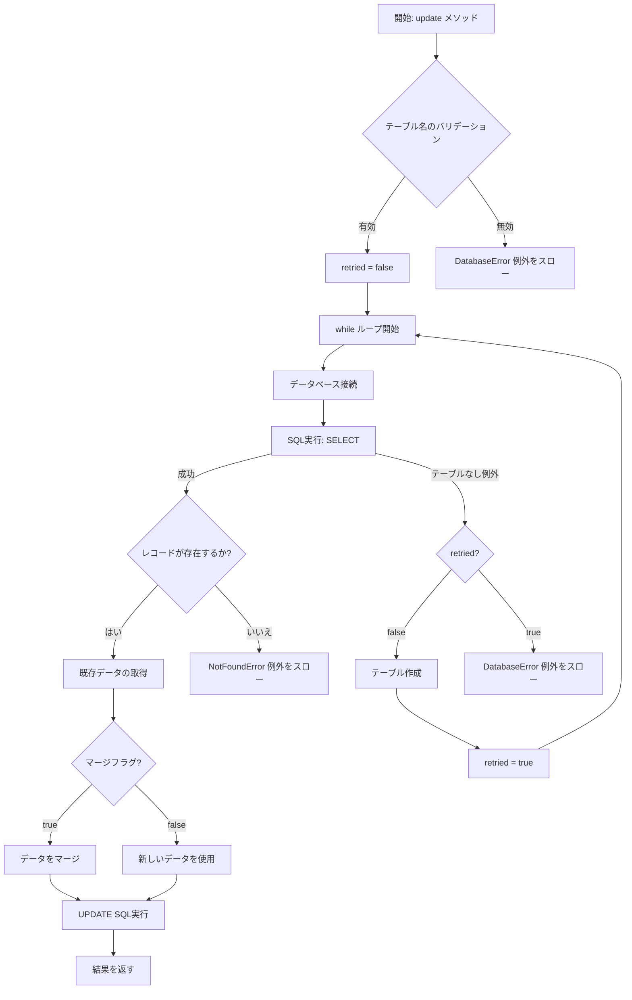

# テーブルが存在しない場合のフローチャート

## updateメソッドにおけるテーブル存在チェックと作成フロー

## テーブルが存在しない場合の処理フロー詳細

1. **初期状態**:
   - `update`メソッドが呼び出される
   - `retried` フラグが `False` に設定される

2. **SQLクエリ実行**:
   - `SELECT data FROM {テーブル名} WHERE id = ?` クエリを実行
   - テーブルが存在しない場合、`sqlite3.OperationalError` が発生

3. **例外処理**:
   - 例外メッセージに "no such table" が含まれるかチェック
   - `retried` フラグが `False` であるかチェック
   - 両方の条件が満たされる場合、テーブル作成処理へ進む

4. **テーブル作成**:
   - `_ensure_collection_table_exists` メソッドを呼び出し
   - このメソッドは `CREATE TABLE IF NOT EXISTS` SQLコマンドを実行
   - テーブルのスキーマ: `id TEXT PRIMARY KEY, data TEXT NOT NULL, created_at TIMESTAMP, updated_at TIMESTAMP`

5. **再試行**:
   - `retried` フラグを `True` に設定
   - `while` ループの先頭に戻り、クエリを再実行

6. **成功または失敗**:
   - テーブル作成後にクエリが成功すれば、通常のデータ更新処理へ
   - 再度失敗した場合、または `retried` が既に `True` の場合、`DatabaseError` 例外をスロー

## テスト戦略

1. **テーブルが存在しない場合のテスト**:
   - 存在しないテーブル名で `update` メソッドを呼び出す
   - テーブルが自動的に作成され、データが正常に更新されることを確認

2. **テーブル作成後の再試行テスト**:
   - テーブル作成後のクエリ再実行が正しく動作することを確認
   - 特に、`retried` フラグの状態管理が適切に行われることを検証

3. **エラー処理テスト**:
   - テーブル作成後も失敗する場合（例：権限不足）の例外処理を検証
   - `DatabaseError` 例外が適切にスローされることを確認

4. **エッジケーステスト**:
   - 無効なテーブル名（空文字、特殊文字のみなど）での動作確認
   - 存在しないIDでの更新操作の挙動確認
