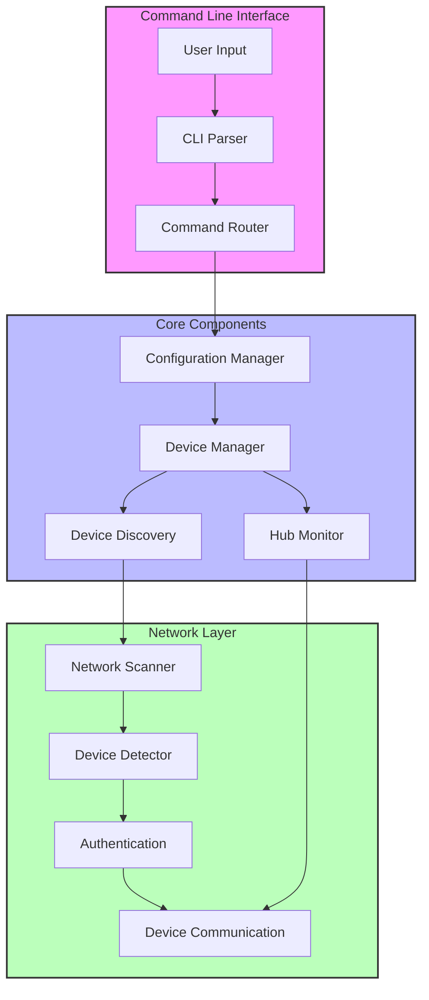
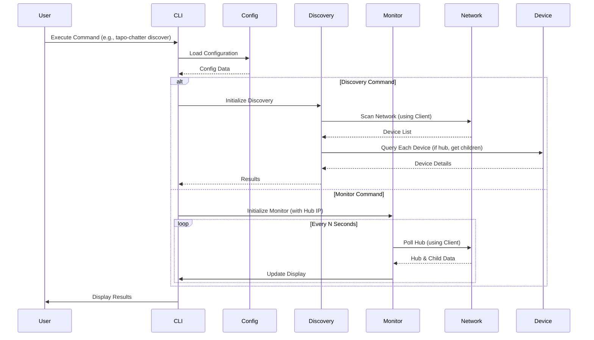
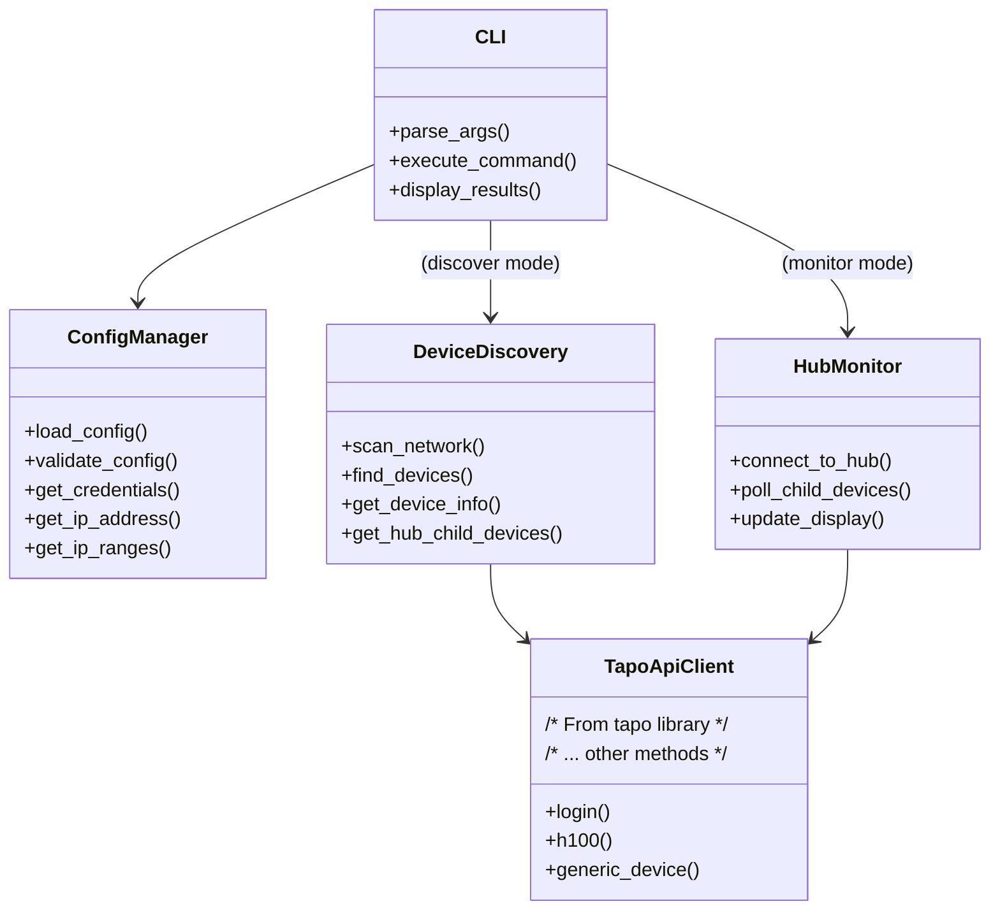

# Tapo Chatter

**A comprehensive Python application for managing, monitoring, and discovering TP-Link Tapo smart home devices, with a special focus on the H100 Hub ecosystem and its connected child devices.**

[](https://pypi.org/project/tapo-chatter/) <!-- Placeholder: Add actual PyPI badge if/when published -->
[](https://www.apache.org/licenses/LICENSE-2.0)

## Overview

Tapo Chatter provides a powerful command-line interface (CLI) to interact with your Tapo smart home devices. Whether you need to quickly discover all Tapo devices on your network, continuously monitor your H100 Hub and its sensors, or get detailed status information, Tapo Chatter has you covered.

It's built with a modular architecture, focusing on robust device communication, detailed data presentation, and a user-friendly experience through the `tapo-chatter` command.

## Key Features

-   🚀 **Unified Command Line Interface (`tapo-chatter`):** Access all functionalities (monitor, discover) via subcommands.
-   📡 **Network Device Discovery:**
    -   Auto-detects local network subnet or scans custom IP ranges.
    -   Parallel scanning for speed, with configurable concurrency and timeout.
    -   Detailed information for discovered devices (IP, Name, Model, Status, Signal, MAC).
    -   Automatic detection of Tapo Hubs and listing of their child devices.
    -   JSON output option for integration with other tools.
    -   Improved error handling and scan statistics.
-   👁️ **H100 Hub & Child Device Monitoring:**
    -   Real-time status updates for H100 Hub and all connected child devices (sensors, buttons, etc.).
    -   Two detailed tables: "Main Device Status" (Name, ID, Type, Online, RSSI, Sensor-specific details) and "Additional Device Information" (HW Ver, MAC, Region, Signal, Battery, Jamming RSSI, etc.).
    -   Critical states (e.g., "Motion: Detected", "Contact: Open") highlighted.
    -   Color-coded signal strength and status indicators.
    -   Configurable polling interval.
-   ⚙️ **Flexible Configuration:** Manage credentials and IP settings via environment variables or `.env` files.
-   📝 **Rich Console Output:** Uses Rich library for clear, formatted tables and status messages.
-   ✅ **Backward Compatibility:** Supports legacy `tapo-monitor` and `tapo-discover` commands.

## Quick Start

1.  **Install:**

    ```bash
    # Recommended: using pipx for isolated CLI environments
    pipx install git+https://github.com/CaptainCodeAU/tapo_chatter.git

    # Or, directly with pip (ensure pip is configured for user installs or use a virtual environment)
    # pip install git+https://github.com/CaptainCodeAU/tapo_chatter.git
    ```

2.  **Configure:**
    Create a `.env` file in the directory where you'll run `tapo-chatter` (or a parent directory), or in `~/.config/tapo_chatter/.env` (you might need to create the `tapo_chatter` directory).
    Content for `.env`:

    ```ini
    TAPO_USERNAME="your_tapo_email@example.com"
    TAPO_PASSWORD="your_tapo_password"

    # For 'tapo-chatter monitor' (if not specifying --ip)
    TAPO_IP_ADDRESS="192.168.1.100" # IP of your H100 Hub

    # For 'tapo-chatter discover' (if not specifying subnet/range)
    TAPO_IP_RANGE="192.168.1.1-192.168.1.254" # Or "192.168.1.0/24"
    ```

    (See [Configuration](#configuration) for more details.)

3.  **Run:**
    ```bash
    tapo-chatter --help
    tapo-chatter monitor
    tapo-chatter discover
    ```

## Supported Devices

Tapo Chatter can detect and display information for various Tapo devices, including but not limited to:

-   **Hubs:** H100 Hub (and all its connected child devices)
-   **Sensors:** T110 Contact, T100 Motion, T300 Water Leak, T31x Temperature/Humidity
-   **Controls:** KE100 Radiator Controllers (TRV), S200B Smart Buttons
-   **Plugs:** P100, P110 Smart Plugs
-   **Lighting:** L510, L530 Smart Bulbs
-   ...and other compatible Tapo smart home devices.

## Prerequisites

-   **Python 3.13+**
-   A **Tapo Account** (email and password).
-   One or more **Tapo H100 Hubs or other Tapo devices** on your local network.
-   For development or specific installation methods:
    -   `git` (to clone/install from repository).
    -   `uv` (optional, an alternative to `pip`, used in some development examples).
    -   `direnv` (optional, recommended for managing environment variables during development).

## Installation

1.  **Clone the Repository (for development or manual install):**

    ```bash
    git clone https://github.com/CaptainCodeAU/tapo_chatter.git
    cd tapo_chatter
    ```

2.  **Set up a Python Environment (Recommended):**
    It's best practice to use a virtual environment.

    ```bash
    # Example using Python's built-in venv
    python3 -m venv .venv
    source .venv/bin/activate # On Windows: .venv\Scripts\activate

    # If you followed "python_setup 3.13" in the original README, that implies
    # a tool like pyenv. Ensure you have Python 3.13+ active.
    ```

3.  **Install the Package:**

    -   **Using `pipx` (Recommended for CLI tools):**
        `pipx` installs Python applications into isolated environments, making them available globally as commands.

        ```bash
        pipx install git+https://github.com/CaptainCodeAU/tapo_chatter.git
        ```

        _(See [Configuration](#configuration) for setting up credentials with `pipx`)_.

    -   **For Development (Editable Install):**
        If you plan to modify the code, install in editable mode from your local clone.

        ```bash
        # Ensure you are in the cloned tapo_chatter directory
        # Using pip (uv pip install -e . is also an option)
        pip install -e .
        ```

    -   **Standard Local Install (from cloned repository):**
        ```bash
        # Ensure you are in the cloned tapo_chatter directory
        # Using pip (uv pip install . is also an option)
        pip install .
        ```

## Configuration

Tapo Chatter requires your Tapo credentials and, depending on the mode, IP information for your devices. These are configured via environment variables or a `.env` file.

**Order of Precedence (highest first):**

1.  **Shell Environment Variables:** Export `TAPO_USERNAME`, `TAPO_PASSWORD`, `TAPO_IP_ADDRESS`, `TAPO_IP_RANGE`.
2.  **Local Project `.env` File:** A file named `.env` in the directory from where you run `tapo-chatter` (or any parent directory). This is often the most convenient, especially for `pipx` users.
3.  **User-Specific `.env` File:**
    -   **Linux/macOS:** `~/.config/tapo_chatter/.env`
    -   **Windows:** Typically `C:\Users\<YourUser>\AppData\Roaming\tapo_chatter\Config\.env`
        _(You may need to create the `tapo_chatter` directory if it doesn't exist. The application will indicate the expected path if it fails to find configuration variables)._

**Example `.env` file content:**

```ini
# Required Authentication (always needed)
TAPO_USERNAME="your_tapo_email@example.com"
TAPO_PASSWORD="your_tapo_password"

# --- For 'monitor' mode (monitoring a single hub) ---
# Used by 'tapo-chatter monitor' if --ip is not specified.
# Example: Your H100 Hub's IP address
TAPO_IP_ADDRESS="192.168.1.100"

# --- For 'discover' mode (scanning network ranges) ---
# Used by 'tapo-chatter discover' if --subnet/--range are not specified.
# You can specify IP ranges in several formats:
# - Single IP: "192.168.1.100" (will scan only this IP)
# - IP range: "192.168.1.100-192.168.1.110"
# - CIDR notation: "192.168.1.0/24"
# - Comma-separated combination: "192.168.1.100,192.168.1.200-192.168.1.210,192.168.0.0/24"
TAPO_IP_RANGE="192.168.1.1-192.168.1.254"

# Note: The application uses TAPO_IP_ADDRESS for single-device operations
# and TAPO_IP_RANGE for multi-device/discovery operations.
# You can have both defined; the relevant one will be picked based on the command.
```

**Note for `pipx` users:** The easiest way to configure after `pipx install` is to create a `.env` file in the directory from which you intend to run `tapo-chatter`, or set the environment variables in your shell's profile (e.g., `.bashrc`, `.zshrc`).

## Usage

Tapo Chatter uses a unified CLI structure with subcommands.

```bash
# General help
tapo-chatter --help

# Get version
tapo-chatter --version
```

### Monitor Mode (`tapo-chatter monitor`)

Continuously polls a Tapo Hub (typically H100) and displays the status of its child devices.

```bash
# Monitor hub specified by TAPO_IP_ADDRESS in .env/environment
tapo-chatter monitor

# Monitor a specific hub IP (overrides TAPO_IP_ADDRESS)
tapo-chatter monitor --ip 192.168.1.100

# Adjust refresh interval (default: 10 seconds)
tapo-chatter monitor --interval 5
```

**Monitor Output Example:**
_(Shows two tables: "Additional Device Information" and "Main Device Status")_


**Main Device Status Table Columns:**

-   Device Name
-   Device ID
-   Device Type
-   Online/Offline Status
-   RSSI (Color-coded)
-   Details: Sensor-specific status (e.g., "Motion: Clear", "Contact: Closed", Temp/Humidity). Critical states are highlighted.

**Additional Device Information Table Columns:**

-   Device Name
-   Hardware Version (HW Ver)
-   MAC Address
-   Region
-   Signal Level
-   Battery Status (OK/Low)
-   Jamming RSSI (Color-coded)
-   Report Interval (s)
-   Last Onboarded Timestamp

### Discover Mode (`tapo-chatter discover`)

Scans your network to find Tapo devices.

```bash
# Discover using TAPO_IP_RANGE from .env, or auto-detect subnet (1-254)
tapo-chatter discover

# Specify subnet (e.g., 192.168.1) and range (e.g., 1-100)
tapo-chatter discover -s 192.168.1 -r 1-100

# Scan only a specific range on the auto-detected/configured subnet
tapo-chatter discover -r 50-150

# Adjust concurrency (default 20) and timeout (default 0.5s)
tapo-chatter discover -l 30 -t 0.3

# Stop after finding a certain number of devices
tapo-chatter discover -n 5

# Output results in JSON format
tapo-chatter discover -j

# Show verbose error summary
tapo-chatter discover -v

# Skip fetching child devices from discovered hubs
tapo-chatter discover --no-children
```

**Discovery Output Example:**


**Discovered Device Information:**

-   IP Address
-   Device Name
-   Model
-   Type
-   Connection Status (Online/Offline) or Power State (On/Off)
-   Signal Level (Color-coded)
-   MAC Address
-   (For Hubs) Lists connected child devices with detailed status.

### Legacy Commands (Backward Compatible)

Original `tapo-monitor` and `tapo-discover` commands are still supported.

```bash
# Legacy Monitor (uses TAPO_IP_ADDRESS from .env)
tapo-monitor
tapo-monitor --ip 192.168.1.100

# Legacy Discover (uses TAPO_IP_RANGE from .env if set, or auto-detects)
tapo-discover
tapo-discover --subnet 192.168.0 --range "100-110" # Note: range is just last octet here
```

## System Architecture & Design

The application features a modular design. For detailed insights, refer to:

-   [System Architecture Diagram](#project-overview) (below)
-   [Code Structure](#code-structure) (below)
-   [Data Flow Diagram](#data-flow) (below)
-   [Component Interaction Diagram](#component-interaction) (below)
-   Detailed documentation in the `docs/` directory:
    -   `docs/ARCHITECTURE.md`: System components, interactions, data flow.
    -   `docs/TECHNICAL_OVERVIEW.md`: Technology stack, implementation details.
    -   `docs/DESIGN.md`: Design philosophy, patterns, decisions.

### Project Overview

#### System Architecture



#### Code Structure

```
tapo_chatter/
├── src/
│   └── tapo_chatter/
│       ├── __init__.py        # Package initialization
│       ├── cli.py            # Command-line interface
│       ├── config.py         # Configuration management
│       ├── device_discovery.py # Device discovery logic
│       ├── discover.py       # Network discovery implementation
│       ├── main.py          # Core application logic (monitor mode)
│       └── utils.py         # Utility functions
├── docs/
│   ├── ARCHITECTURE.md      # System architecture details
│   ├── TECHNICAL_OVERVIEW.md # Technical implementation details
│   ├── DESIGN.md           # Design decisions and patterns
│   └── images/             # Architectural and flow diagrams
├── tests/                  # Test suite
└── scripts/               # Development and maintenance scripts
```

#### Data Flow



#### Component Interaction



## Troubleshooting

Common issues and solutions:

1.  **Connectivity Problems:**

    -   Ensure your computer is on the same Wi-Fi/network as your Tapo devices.
    -   Verify the IP address of your hub (for monitor mode) is correct.
    -   Check your firewall settings; they might be blocking local network communication.
    -   Try pinging the device IP from your terminal.

2.  **Authentication Issues:**

    -   Double-check your Tapo username (email) and password in your `.env` file or environment variables.
    -   Ensure you are using the correct email associated with your Tapo account.

3.  **Device Not Found/Showing Offline:**

    -   Confirm the device is powered on and connected to your network (check its LED status).
    -   Verify it's visible and operational in the official Tapo mobile app.
    -   Try rebooting the Tapo device.
    -   For discovery, ensure the IP range being scanned includes the device's IP.

4.  **"TAPO_USERNAME and TAPO_PASSWORD environment variables are required" Error:**
    -   You haven't configured your credentials. See the [Configuration](#configuration) section.

## Contributing

Contributions are welcome! If you'd like to contribute, please follow these general steps:

1.  Fork the repository.
2.  Create a new branch for your feature or bug fix (`git checkout -b feature/my-new-feature`).
3.  Set up your development environment (see [Installation](#installation) for editable installs).
4.  Make your changes.
5.  Write or update tests for your changes.
6.  Ensure your code lints and tests pass.
7.  Update documentation if necessary.
8.  Commit your changes (`git commit -am 'Add some feature'`).
9.  Push to the branch (`git push origin feature/my-new-feature`).
10. Open a Pull Request.

Please feel free to open an issue first to discuss any significant changes.

## License

This project is licensed under the Apache License, Version 2.0. See the [LICENSE](LICENSE) file for details.

## Acknowledgments

-   Built using the [Tapo Python Library](https://github.com/mihai-dinculescu/tapo) by Mihai Diculescu.
-   Thanks to the TP-Link Tapo team for their excellent smart home devices.

## Version History

### v0.3.0 (Latest)

-   Introduced unified `tapo-chatter` command-line interface with `monitor` and `discover` subcommands.
-   Enhanced `TAPO_IP_RANGE` to support multiple formats (single IP, range `X-Y`, CIDR, comma-separated).
-   Refined command-line flags for better control over discovery and monitoring.
-   Added backward compatibility for legacy `tapo-monitor` and `tapo-discover` commands.
-   Improved documentation with clearer installation, configuration, and usage examples.
-   Monitor mode: Displays two detailed tables for H100 child devices.
-   Discover mode: Can now list child devices of discovered Hubs.
-   General code structure improvements and error handling enhancements.

### v0.2.0

-   Added initial support for H100 Hub child device monitoring (`tapo-monitor`).
-   Improved device discovery (`tapo-discover`) with parallel scanning for speed.
-   Added JSON output option for discovery results.
-   Enhanced error handling with structured summaries in verbose discovery mode.

### v0.1.0

-   Initial release.
-   Basic device discovery functionality.
-   Simple hub monitoring capabilities (less detailed than v0.2.0+).
