# UL - Unified Lattice 🔄

A Python library that automatically generates a directed acyclic graph (DAG) representing all possible input-output relationships among a set of functions.

[](https://www.python.org/downloads/)
[](LICENSE)

## Overview 📚

UL (Unified Lattice) enables developers to input a set of functions and automatically generate a directed acyclic graph (DAG), or lattice, representing all possible input-output relationships. Unlike traditional pipeline tools that assume a single, linear flow from inputs to outputs, UL produces a comprehensive graph where users can extract specific subgraphs (sub-DAGs) to perform targeted tasks.

### Key Features 🌟

- **Flexible Input Formats**: Accept functions as code, signatures, docstrings, or natural language descriptions
- **Intelligent Relationship Inference**: Uses OpenAI's GPT models to identify potential connections between functions
- **Comprehensive Visualization**: Generate Mermaid diagrams to visualize the lattice
- **Subgraph Extraction**: Extract specific parts of the lattice for targeted tasks
- **Type Compatibility Checking**: Validate input-output relationships based on type annotations

## Installation 💾

```bash
pip install ul
```

## Quick Start 🚀

```python
import ul

# Define functions as code strings
functions = [
    """
    def load_csv(file_path: str) -> pd.DataFrame:
        '''Loads a CSV file into a DataFrame.'''
        pass
    """,
    """
    def split_data(df: pd.DataFrame) -> tuple[pd.DataFrame, pd.DataFrame]:
        '''Splits data into training and testing sets.'''
        pass
    """,
    """
    def train_model(train_df: pd.DataFrame) -> object:
        '''Trains a model on the given data.'''
        pass
    """,
    """
    def evaluate_model(model: object, test_df: pd.DataFrame) -> dict:
        '''Evaluates the model on test data.'''
        pass
    """
]

# Generate the lattice
lattice = ul.generate_lattice(functions, openai_api_key="your-api-key")

# Visualize the lattice
mermaid_code = ul.visualize_lattice(lattice)
print(mermaid_code)

# Extract a subgraph for a specific task
training_subgraph = ul.extract_subgraph(
    lattice, 
    start_functions=["load_csv"], 
    end_functions=["train_model"]
)

# Save the subgraph visualization to a file
ul.visualize_lattice(training_subgraph, output_file="training_workflow.md")
```

## Input Formats 📝

UL supports multiple ways to define functions:

### Code Snippets

```python
def load_csv(file_path: str) -> pd.DataFrame:
    """Loads a CSV file into a DataFrame."""
    pass
```

### Function Signatures

```
load_csv(file_path: str) -> pd.DataFrame
```

### Docstrings

```
load_csv: Takes a file path (string) and returns a pandas DataFrame.
```

### Natural Language Descriptions

```
A function that loads a CSV file into a data frame.
```

## Output Formats 📊

### Structured JSON

```python
json_output = lattice.to_structured_output()
```

Example output:

```json
{
  "functions": [
    {
      "name": "load_csv",
      "args": [{"name": "file_path", "type": "str"}],
      "return_type": "pd.DataFrame",
      "docstring": "Loads a CSV file into a DataFrame."
    },
    {
      "name": "split_data",
      "args": [{"name": "df", "type": "pd.DataFrame"}],
      "return_type": "tuple[pd.DataFrame, pd.DataFrame]",
      "docstring": "Splits data into training and testing sets."
    }
  ],
  "links": [
    {
      "from": {"function": "load_csv", "output": "return"},
      "to": {"function": "split_data", "arg": "df"}
    }
  ]
}
```

### Mermaid Diagram

```python
mermaid_code = lattice.to_mermaid_output()
```

Example output:



```mermaid
graph TD
    load_csv["load_csv(file_path: str) → pd.DataFrame"]
    split_data["split_data(df: pd.DataFrame) → tuple[pd.DataFrame, pd.DataFrame]"]
    train_model["train_model(train_df: pd.DataFrame) → object"]
    evaluate_model["evaluate_model(model: object, test_df: pd.DataFrame) → dict"]
    load_csv --> split_data
    split_data --> train_model
    split_data --> evaluate_model
    train_model --> evaluate_model
```

## API Reference 📘

### Core Functions

#### `generate_lattice(functions, openai_api_key=None, model="gpt-4", input_type="auto")`

Generate a lattice (DAG) based on function input-output relationships.

#### `extract_subgraph(lattice, start_functions=None, end_functions=None, include_functions=None)`

Extract a subgraph from the lattice for a specific task.

#### `validate_lattice(lattice)`

Ensure the lattice is a valid DAG (no cycles) and that input-output links are type-compatible.

#### `visualize_lattice(lattice, output_file=None)`

Renders the lattice as a Mermaid diagram or saves to a file.

### Input Processing

#### `process_code_input(code_strings)`

Process a list of Python function code strings to extract metadata.

#### `process_signature_input(signatures)`

Process a list of function signatures to extract metadata.

#### `process_docstring_input(docstrings, api_key, model="gpt-4")`

Process a list of docstrings to extract function metadata using OpenAI.

#### `process_natural_language_input(descriptions, api_key, model="gpt-4")`

Process natural language descriptions to extract function metadata using OpenAI.

## Lattice Class

The `Lattice` class represents a directed acyclic graph of functions and provides methods for output and analysis.

### Methods

#### `to_structured_output()`

Convert the lattice to a structured JSON-like format.

#### `to_mermaid_output()`

Generate a Mermaid graph specification for visualization.

## Use Cases 🧩

### Data Science Pipelines

Create a lattice for data processing, model training, and evaluation:

```python
lattice = ul.generate_lattice([
    "def load_data(path: str) -> pd.DataFrame: ...",
    "def preprocess(df: pd.DataFrame) -> pd.DataFrame: ...",
    "def train_model(df: pd.DataFrame) -> Model: ...",
    "def evaluate(model: Model, test_data: pd.DataFrame) -> dict: ...",
    "def save_model(model: Model, path: str) -> None: ...",
])

# Extract only the training pipeline
training = ul.extract_subgraph(lattice, end_functions=["train_model"])
```

### API Integration

Connect API functions in a workflow:

```python
lattice = ul.generate_lattice([
    "def fetch_user_data(user_id: str) -> dict: ...",
    "def validate_user(user_data: dict) -> bool: ...",
    "def process_payment(user_id: str, amount: float) -> dict: ...",
    "def generate_receipt(payment_data: dict) -> str: ...",
])

# Create a payment processing workflow
payment_flow = ul.extract_subgraph(
    lattice, 
    start_functions=["fetch_user_data"],
    end_functions=["generate_receipt"]
)
```

## Environment Variables 🔐

Set your OpenAI API key as an environment variable:

```bash
export OPEN_API_KEY="your-api-key"
```

## Requirements 📋

- Python 3.8+
- openai
- networkx
- matplotlib (optional, for custom visualizations)

## Contributing 🤝

Contributions are welcome! Please feel free to submit a Pull Request.

## License 📜

This project is licensed under the MIT License - see the LICENSE file for details.

## Acknowledgments 🙏

- This package uses OpenAI's GPT models for function relationship inference
- NetworkX for graph operations
- Mermaid for graph visualization

---

🔄 Built with UL - Connecting Your Functions in Harmony